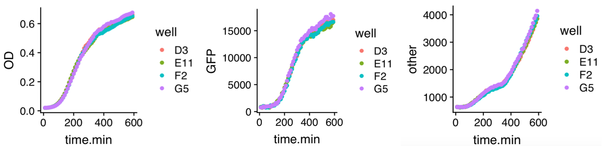
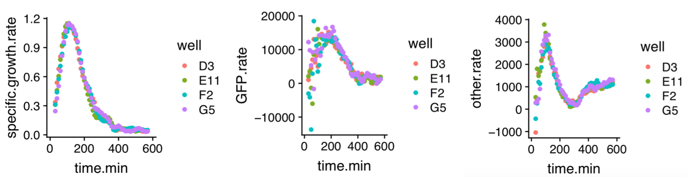
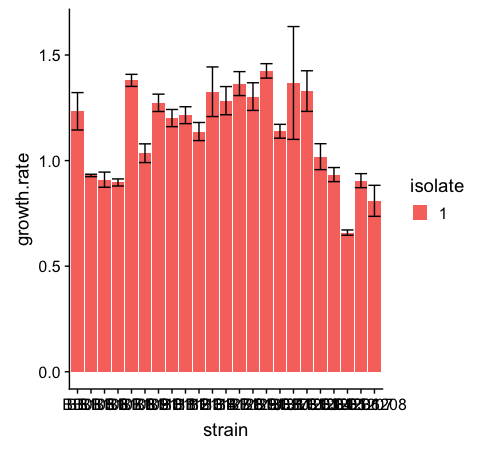
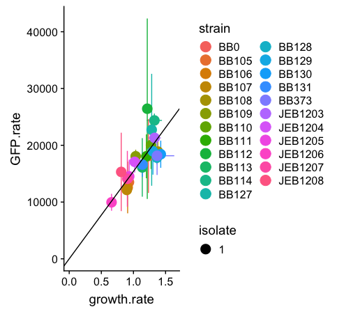

# Burden analysis for a single data set 

**Required files:** An experiment folder (expXXX) containing the metadata and measurements files from the burden assay.

   - They need be saved with the .csv or .tsv file extension.  
   - (Note that the “XXX” should be a unique burden assay experiment number (such as exp001, exp002, etc). 

To analyze a single data set (from one burden assay), download the `burden_fit.R` and  `burden_summary.R` scripts, found in the `scripts` folder. 

2. Open the `burden_fit.R` file on RStudio. 

      - Download all the required packages: tidyverse, gridExtra, cowplot, optparse.  
 
3.	Set the working directory to the expXXX folder.

4.	Define the variable `input.prefix` in the console, then run the full script. 

      - Example: `input.prefix = “exp057”`

5.	If no errors occur, the expXXX file should now have many new output files. See the `exp057` folder for examples. 

      - *Example output files for exp057 (Anderson series of promoters with RFP)*: 
      
         - `exp057.settings.csv`, a dataframe that prints out all of the options that were used in the fitting.
         - `exp057-plots` folder, which contains three types of files for each strain that was measured: 
            - `samplename.pdf`: A pdf with three plots, one for GFP, one for OD, and one for growth, all as a function of time. These plots were generated using the raw measurement values from the plate reader. 
     
            - `samplename.rates.pdf`: A pdf with three plots, each graphing either the calculated ‘specific.growth.rate’, ‘GFP.rate’, or ‘other.rate’ values as a function of time, for each replicate corresponding to the sample:   

         -  `exp057.tidy.metadata.csv` and `exp057.tidy.measurements.csv`- these are the products of the tidyr function, which cleaned up the metadata and measurement files that were initially imported into the script. 
         - `exp057.rates.all.csv`, a file containing rate calculations (growth, GFP, and 'other') for all wells in the assay. The sample file can be found in the `exp057` folder.
         - `exp057.rates.summary.csv`, which reports the mean rate calculations (of all replicates) for each stain. In this file, each strain has a corresponding mean rate value (GFP, growth, 'other'), with the values of the standard deviations and upper/lower bounds of the 95% confidence intervals of the means. The sample file can be found in the `exp057` folder.
         **This file will be used to generate the summary graphs for the burden assay (using the `burden_summary.R` script).**  
         
         
         
8. Open the `burden_summary.R` script on RStudio. Ensure the working directory is still set to the correct expXXX folder.

   - Required packages: tidyverse, plotly, gridExtra, cowplot, optparse, xtable. 

9. Define the variable `input.file.string` in the console, then run the script. 
   
   - Example: `input.file.string = “exp057.rates.summary.csv”`.

10. If no errors occur, the expXXX file should now have four new files. The script generates two types of summary graphs: a **growth rate plot**, and a **burden vs growth rate plot**. Both files come in two forms: a pdf and an interactive plotly (html) file. 
   
    - *Example output files for exp057 (Anderson series of promoters with RFP)*: 
   
      - `exp057.rates.summary.growth_rates.pdf` and `exp057.rates.summary.growth_rates.html` - this plots the growth rate of each strain in the assay, with error bars representing the 95% confidence interval of the mean growth rate (mean of all replicates for each strain): 
      
      
      
      - `exp057.rates.summary.burden_vs_growth_rates.pdf` and `exp057.rates.summary.burden_vs_growth_rates.html` - this linear regression plot graphs the mean GFP rate of each strain as a function of mean growth rate. Each point represents a different strain, and has error bars representing the 95% confidence interval for both variables (mean growth and GFP rates):  
      
      
 

