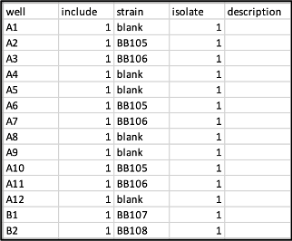
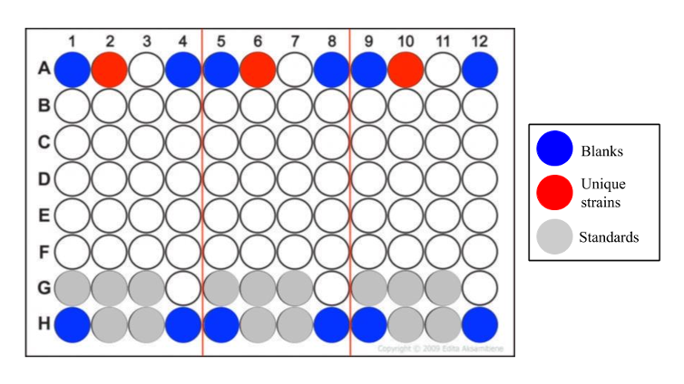

# Wet Lab Protocol 

1.	Retrieve and resuspend Biobrick kit distribution samples as described on iGEM webpage: http://parts.igem.org/Help:2019_DNA_Distribution

2.	Transform 1 µl of resuspended BioBrick samples into a 50 µl aliquot of chemically competent burden monitor strain cells (CalCl2 chemical competent cells; burden monitor cells made as described in methods section). Incubate transformants overnight at 37C on LB agar plates supplemented with appropriate antibiotics: (1) 50 mg/mL Kanamycin (burden monitor strain is kanamycin-resistant), and (2) the antibiotic(s) in the Biobrick plasmid backbone. 

3.	Pick an antibiotic-resistant colony from the plate and inoculate in a culture tube with 5 mL LB and appropriate antibiotics. Incubate overnight at 37C (~250rpm). If performing a burden assay the next day, prepare overnight cultures of JEB1204-JEB1208 (BFP control strains, inoculate in 5mL LB supplemented with 50 mg/mL Kanamycin + 20 mg/mL Chloramphenicol).  

    - Important note: cells should be cultured as little as possible (~18 hrs) after picking the colony to avoid mutations, especially with burdensome plasmids. 

4.	Next day: Freeze down 15% glycerol stocks of cultures at -80C and perform burden assay. 

5.	Burden assay (adapted from Ceroni 2015): 
    - **Required materials:**
        - Required samples: overnight cultures of JEB1204 – JEB1208, and any transformed BioBrick cultures. 
        - Plate reader (we use Tecan Infinite Pro M200 Plate Reader)  
        - 96 well plate: Black with clear optical bottom and clear lid (we use Nunc™ MicroWell™ 96-Well Optical-Bottom Plates (Thermo Scientific Catalog Number 265301)). 
        - Preheated LB media

### Steps for burden assay:  

 1.	Turn on the plate reader and let it heat to 37C. 
 2.	Create a metadata file (named expXXX.metadata.csv) which will map out the samples in the plate. The file should follow the formatting shown in the image below.  Instuctions on metadata file setup (with examples) are found here: https://github.com/barricklab/burden. 
    - XXX denotes unique experiment number/burden assay run  
    - Sample metadata file:   
 

You will pipette 5µl of each culture in triplicate (for example: one culture is placed in G1, G5, G9, another culture is placed in G2, G6, G10, etc.), as displayed in the diagram below:  
   

3. First, prepare the Standard and Blank wells: 
   - Following the diagram shown above, pipette 5µl of each BFP standard (JEB1204-JEB1208) in triplicate (for example: one culture is placed in G1, G5, G9, another culture is placed in G2, G6, G10, etc.).
   - For Blanks (indicated by blue wells): just add 5µl LB  

4. Load 5 µl of each “unique” transformed biobrick culture in triplicate.
   - This allows up to 23 unique strains to be measured per plate.
   - If you have less than 23 unique strains, load the rest of the wells with 5µl LB, and treat as blanks.  

5. Finally, pipette 195µl preheated LB to all wells, using a multichannel pipette. Pipette contents up and down to ensure they are mixed properly.  

6. Ensure the plate reader has reached 37C, then load the plate in the plate reader.  

7.	Run a burden assay program set to the following parameters: 
    - Record optical density at 600 nm and GFP fluorescence (excitation: 485 nm; emission 528 nm) levels every 10 minutes with 7 minutes of orbital shaking during each cycle. 
    - We use the Magellan software program.
8.	Run each burden assay for a minimum of 6 hours. 
    - If you choose to run for 6 hours (or any amount of time that ends before the program automatically ends), you can “break” the program. Data will not get lost, this action will simply end the run. 

9.	After the run (either after 6 hours or when Magellan/program automatically ends):  

    1.	 An excel sheet should have automatically opened, and it contains the measurements from the completed burden assay. Save this file using the following formatting: “expXXX.measurements.csv” 
    2.	With the Magellan window still open, click “export as ascii” from the file menu, and name the file “expXXX.measurements.asc.” This file will serve as a backup measurements file. 

10.	Create a folder that combines (1) the metadata file from step 2, (2), the measurements file from step 9, and (3), the burden assay program that was used for this particular run (to record the plate reader settings that were used).   

    - Name this folder “expXXX.” (Example: exp057)
      - Ensure that both the metadata and measurements files are saved with the .csv (or .tsv) file extension (and not the .xls or .xlsx file extensions).  

11.	Next step: Data analysis (computational protocol). 

